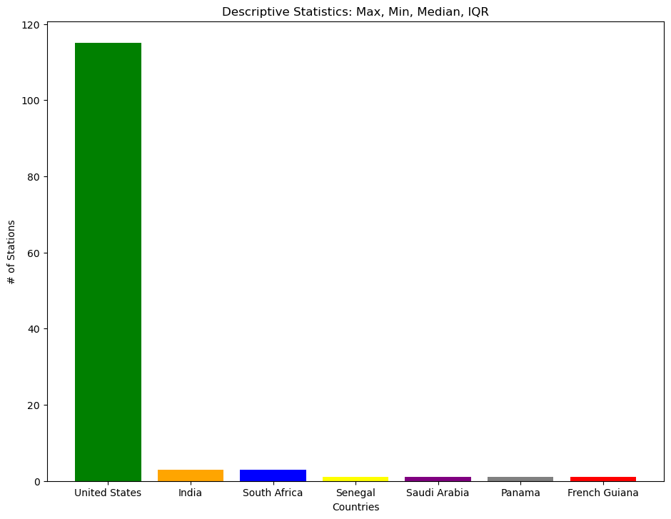
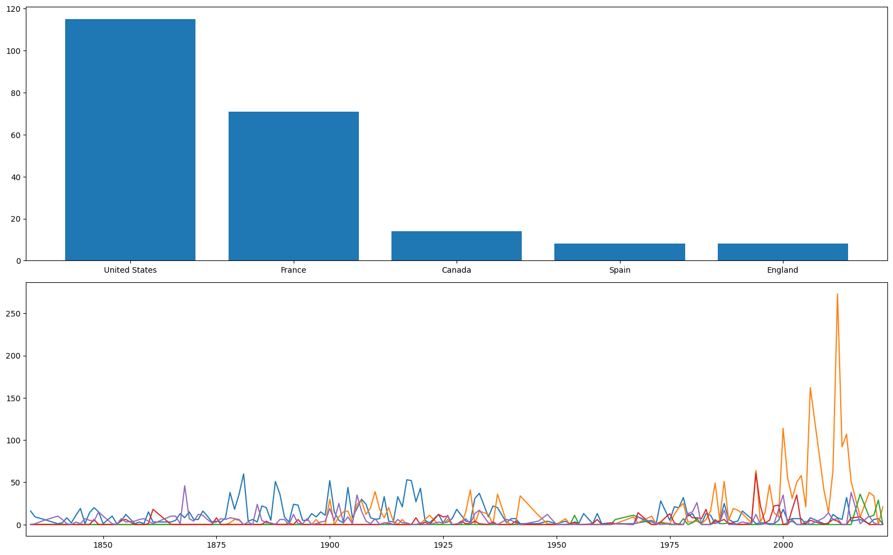
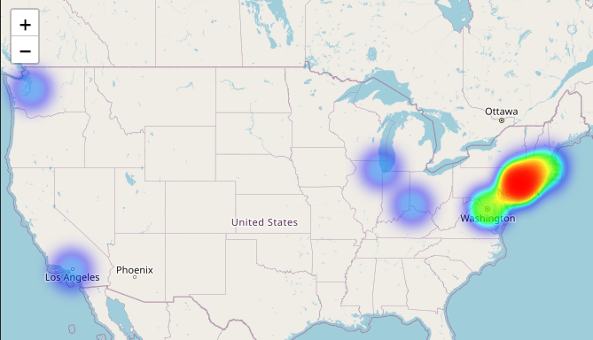

# MMJ Analytics
 
 
 

# Transit Systems of the World

***
 

## Table of Contents
- [Introduction](#introduction)
- [Overall](#overall)
- [Top 5 Countries](#top-5-countries)
- [US Transit Line Counts](#us-transit-line-counts)
- [US Heatmap](#us-heatmap)
 
 

### **Introduction**
This dataset, which can be found [here](https://www.kaggle.com/datasets/citylines/city-lines), includes transportation line data from a number of cities from around the world including London, Berlin, Mexico City, Barcelona, Washington D.C., and others covering many thousands of kilometers of lines.
 
 
 

### **Overall**
The data mentioned above informs people of several different factors pertaining to transportation lines around the world. An initial glimpse of the data, allowed us to indentify how the data was spread amongst the countries in the [cities]("data/cities.csv) data. As you can see, the United States has an overwhelming amount of cities with stations compared to the rest of the countries within the data. 
This led us to indetify the [top five](#top-5-countries) countries to see how the United States compared.

 
 
 

### **Top 5 Countries**

 
 
 

### **US Transit Line Counts**
After indentifying the United States held the most cities, further analysis was conducted on those cities within the United States. What can be immeditaely identified is that the cities withing the United States are large metropolitan cities. Furthermore, it is important to note that there are other cities within the United States that host transportation stations, however the [station](data/stations.csv) data does not hold information for those cities not listed. This is important to note this is one limitation of this data set.

 
 
 
### US Heatmap
Additinally cities within the United States that host a transportation station are represented below with the a provides a visual representation of the density of the stations within those cities.

 

Click this [interactive map](http://127.0.0.1:5500/images/us_heatmap.html) to view and zoom to certain areas.