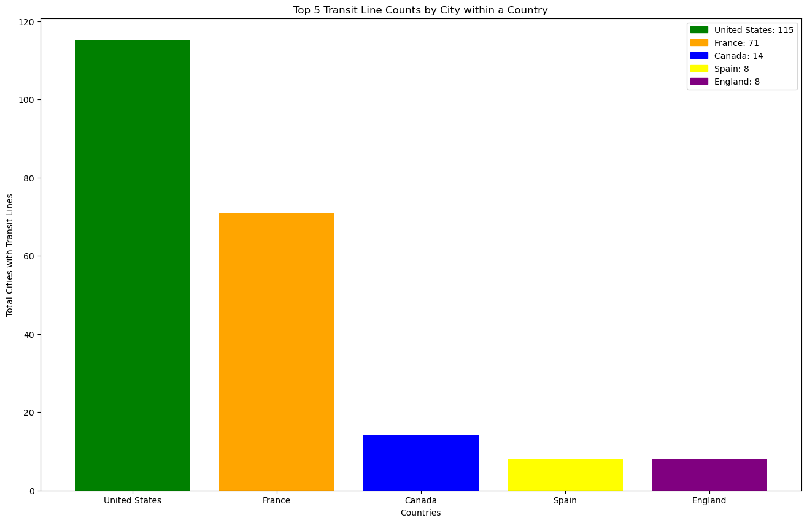

# MMJ Analytics
 
 
 

# Transit Systems of the World

***
 

## Table of Contents
- [Introduction](#introduction)
- [Overall](#overall)
- [Top 5 Countries](#top-5-countries)
- [US Transit Line Counts](#us-transit-line-counts)
- [US Heatmap](#us-heatmap)
 
 

### **Introduction**
This dataset, which can be found [here](https://www.kaggle.com/datasets/citylines/city-lines), includes transportation line data from a number of cities from around the world including London, Berlin, Mexico City, Barcelona, Washington D.C., and others covering many thousands of kilometers of lines.
 
 
 

### **Overall**
The data mentioned above informs people of several different factors pertaining to transportation lines around the world. An initial glimpse of the data, allowed us to indentify how the data was spread amongst the countries in the [cities]("data/cities.csv) data. As you can see, the United States has an overwhelming amount of cities with stations compared to the rest of the countries within the data. 
This led us to indetify the [top five](#top-5-countries) countries to see how the United States compared.

 
 
 

### **Top 5 Countries**

 
 
 

### **US Transit Line Counts**
Transit Lines for cities in the UNited States.

 
 
 

### **US Heatmap**
The following is a graphical representation of the stations within the United States.

 

Click this [interactive map](http://127.0.0.1:5500/images/us_heatmap.html) to view and zoom to certain areas. can be found here.