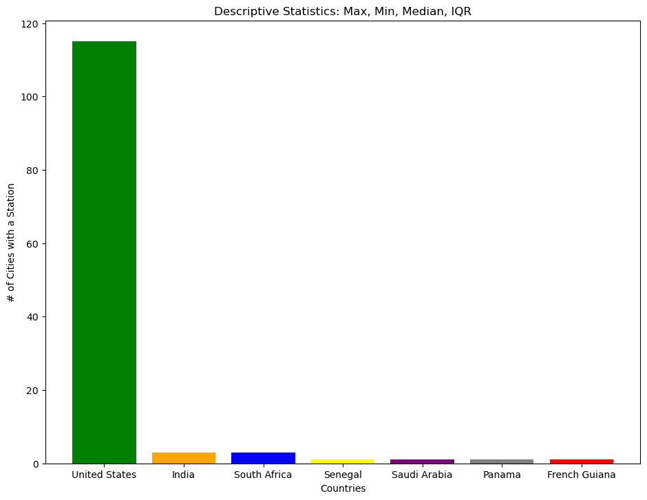

# MMJ Analytics
 
 
 

# Transit Systems of the World

***
 

## Table of Contents
- [Introduction](#introduction)
- [Overall](#overall)
- [Spread](#spread)
 
 

### **Introduction**
This dataset, which can be found [here](https://www.kaggle.com/datasets/citylines/city-lines), includes transportation line data from a number of cities from around the world including London, Berlin, Mexico City, Barcelona, Washington D.C., and others covering many thousands of kilometers of lines.
 
 
 

### **Overall**
Top 5 countries in the world

 
 
 

### **Spread**
Interquartile ranges for all data

### **US Transit Line Counts**
Transit Lines for cities in the UNited States.

